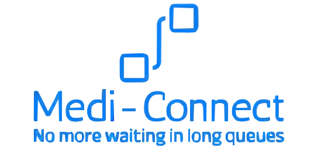

<div align="center" width="100%">
    
</div>

# Med-Space (Appointment Booking System)


## Table of Contents

- [Introduction](#introduction)
- [Features](#features)
- [Tech Stack](#tech-stack)
- [Demo](#demo)
- [Getting Started](#getting-started)
  - [Prerequisites](#prerequisites)
  - [Installation](#installation)
  - [Configuration](#configuration)
- [Usage](#usage)
- [Project Structure](#project-structure)
- [Contributing](#contributing)
- [License](#license)
- [Contact](#contact)

## Introduction

The **Medi-Connect (Appointment Booking System)** is a comprehensive web-based solution designed to streamline hospital operations by implementing efficient queuing models for Outpatient Departments (OPDs), real-time bed availability tracking, patient admission management, and inventory management for medicines and consumables. This system is scalable and can be integrated with a city-wide module, facilitating seamless coordination across multiple healthcare institutions.

Developed for the Smart India Hackathon, this platform aims to enhance patient experience, optimize hospital resources, and improve overall healthcare delivery in urban settings.

## Features

- **OPD Queue Management**

  - Real-time tracking of patient queues
  - Online appointment scheduling
  - Notifications and alerts for patients

- **Bed Availability Management**

  - Real-time monitoring of bed occupancy
  - Emergency bed allocation
  - Filtering and sorting options for bed status

- **Patient Admission System**

  - Streamlined admission process
  - Integrated patient information and history
  - Doctor and nurse coordination tools

- **Inventory Management**

  - Stock level monitoring for medicines and consumables
  - Automated alerts for low stock
  - Inventory usage reporting and analytics

- **User Roles and Authentication**

  - Doctor and Patient roles
  - Secure authentication and authorization
  - Role-based access control

- **City-Wide Integration**
  - Data sharing across multiple hospitals
  - Centralized health management system integration
  - Scalable architecture for city-wide deployment

## Tech Stack

- **Frontend**

  - [React.js](https://reactjs.org/)
  - [Redux](https://redux.js.org/) (for state management)
  - [React Router](https://reactrouter.com/)
  - [Axios](https://axios-http.com/) (for API calls)
  - [CSS3](https://developer.mozilla.org/en-US/docs/Web/CSS) / [SASS](https://sass-lang.com/)

- **Backend**

  - [Node.js](https://nodejs.org/)
  - [Express.js](https://expressjs.com/)
  - [MongoDB](https://www.mongodb.com/) (or PostgreSQL/MySQL)
  - RESTful APIs
  - [JWT](https://jwt.io/) for authentication

- **Deployment**

  - [Render](https://www.render.com/)
  - [Netlify](https://www.netlify.com/)

- **Other Tools**
  - [Git](https://git-scm.com/) & [GitHub](https://github.com/)
  - [Postman](https://www.postman.com/) (for API testing)
  - [ESLint](https://eslint.org/) & [Prettier](https://prettier.io/) (for code quality)

## Demo

[[Visit the deployment]](https://medi-connect-in.netlify.app/)

## Getting Started

Follow these instructions to set up a local copy of the repository on your machine for development and testing purposes.

### Prerequisites

Ensure you have the following installed on your local machine:

- [Node.js](https://nodejs.org/) (v14 or later)
- [npm](https://www.npmjs.com/) or [Yarn](https://yarnpkg.com/)
- [Git](https://git-scm.com/)
- [MongoDB](https://www.mongodb.com/) (if using MongoDB as the database)
- [Docker](https://docs.docker.com/engine/install/)

### Installation

1. **Clone the Repository**

   ```bash
   git clone https://github.com/Luson045/medi-connect
   cd medi-connect
   ```

2. **Install Backend Dependencies**

   ```bash
   cd server
   npm install
   ```

3. **Install Frontend Dependencies**

   ```bash
   cd client
   npm install
   ```

4. **Backend Configuration**

- Open the `.env` file and update the following variables:

```env
PORT=5000
PASSDB=your_mongodb_connection_string
JWT=your_jwt_secret
```

### Installation via Docker

1. **Clone the Repository**

   ```bash
   git clone https://github.com/Luson045/medi-connect
   cd medi-connect
   ```

2. Run the following commands
   ```
       docker compose build
       docker compose up
   ```

3. To close the running containers run `docker compose down`
 
4. Frontend will be running on `localhost:3000` and backend server on `localhost:5000`

*** Video Guide for how to run project via Docker


https://github.com/user-attachments/assets/37a9973b-d42b-4b8f-99db-dd14cf5d069e


## Usage

The backend server should be running at `https://medi-connect-f671.onrender.com`.

**Start the Frontend Server**

The frontend application should be running at `http://localhost:3000`.

**Access the Application**

Open your web browser and navigate to `http://localhost:3000` to access the Medi-Connect(Application Booking System).

- **backend/**: Contains the server-side code, including API routes, controllers, models, and configuration files.
- **frontend/**: Contains the client-side code built with React.js, including components, pages, context, and services.

**Code Formatting**

To ensure consistent code formatting across the project, you can use the following scripts:

- Run `npm run format` to format your code according to Prettier's rules.
- Run `npm run format-check` to check if the code is formatted correctly.

Make sure to run these commands in both the `client` and `server` directories.

## 👀 Our Contributors

- We extend our heartfelt gratitude for your invaluable contribution to our project! Your efforts play a pivotal role in elevating Med-Space to greater heights.
- Make sure you show some love by giving ⭐ to our repository.

<div align="center">

  <a href="https://github.com/Luson045/medi-connect">
    
  </a>
</div>

## License

This project is licensed under the [MIT License](LICENSE).

## Contact

For any inquiries or support, please contact:

- **Luson Basumatary**
- **Email:** yuria4489@gmail.com
